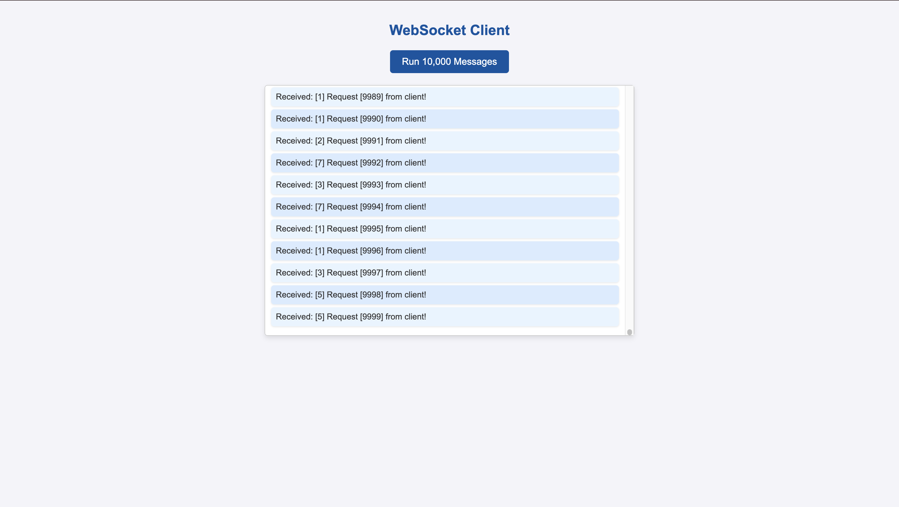

# Web-Sockets-and-GPT-Models-

#### Overview
This project includes a browser-based WebSocket client interface that connects to a WebSocket server, sends messages in real time, and displays responses. The setup demonstrates WebSocket’s full-duplex communication, which allows continuous two-way data exchange between the client and server.

The client sends an initial message and then automatically loops 10,000 times, exchanging messages with the server. The user can view all message exchanges in a styled, scrollable message area on the webpage.

#### Project Files
- **`index.html`**: The main HTML file containing the WebSocket client interface.
- **CSS** (included in `<style>` tags or an external CSS file): Styles the interface, giving it a clean and user-friendly look.

---

### `index.html` Structure

#### HTML Layout

1. **Title and Heading**:
   - Displays a title (`WebSocket Client Interface`) in the browser tab and a heading (`WebSocket Client`) at the top of the page.
   
2. **Button**:
   - A button labeled "Run 10,000 Messages" allows the user to initiate the message loop manually.
   
3. **Message Display Area**:
   - A `
` element with an ID `messages` displays incoming messages in a scrollable view.

#### JavaScript Functions

- **`connectWebSocket()`**: 
   - Establishes a connection to the WebSocket server at `ws://localhost:8765`.
   - Sets up event listeners to manage connection events:
      - `onopen`: Logs when the connection is established.
      - `onmessage`: Displays each received message and then automatically sends a new message back to the server until the loop completes 10,000 exchanges.
      - `onclose`: Logs the closing of the WebSocket connection.
      - `onerror`: Logs any errors during the WebSocket connection.

- **`startLoop()`**:
   - Ensures that the WebSocket connection is open and sends the first message to start the 10,000-message loop.
   - Displays a console message if the connection isn’t open.

- **Automatic Connection on Page Load**:
   - The WebSocket connection automatically opens when the page loads (`window.onload`), allowing the user to start sending messages right away.

#### CSS Styling

1. **Body**:
   - Sets a centered, clean look for the entire page with a light background and consistent font.
   
2. **Button**:
   - Provides an interactive button with hover and active states to improve usability and visual feedback.

3. **Message Display Area**:
   - The `#messages` `
` is styled as a box with scrollable content, border, and soft shadow.
   - Each message (`
` elements inside the div) has padding and rounded borders, alternating background colors for readability.

---

### Installation and Usage

1. **Setting up the WebSocket Server**:
   - Before running this client, ensure the WebSocket server is up and running on `ws://localhost:8765` (see server setup instructions).

2. **Opening the WebSocket Client**:
   - Open the `index.html` file in a web browser.
   - Click **Run 10,000 Messages** to initiate the WebSocket message loop.
   
3. **Viewing Messages**:
   - As messages are exchanged, they will appear in the message display area, which can be scrolled if needed.
   - The loop will automatically stop after completing 10,000 exchanges, closing the WebSocket connection.

---

### Example Usage Scenario
1. Open `index.html` in the browser.
2. Click **Run 10,000 Messages** to test the server’s handling of rapid, bidirectional communication.
3. Observe messages appearing in the display area, verifying real-time WebSocket data exchange.

This setup is ideal for real-time applications like chat interfaces or live data monitoring dashboards, where continuous, asynchronous message exchange is critical.